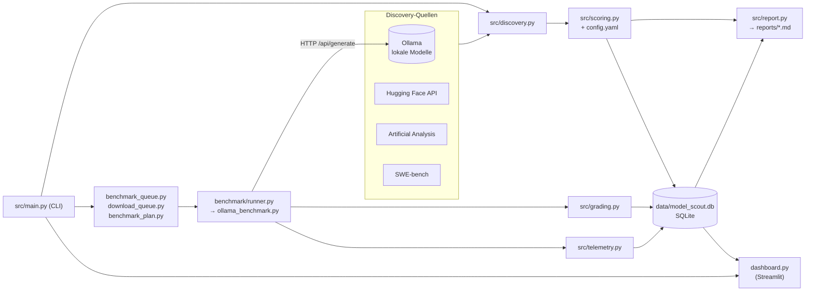
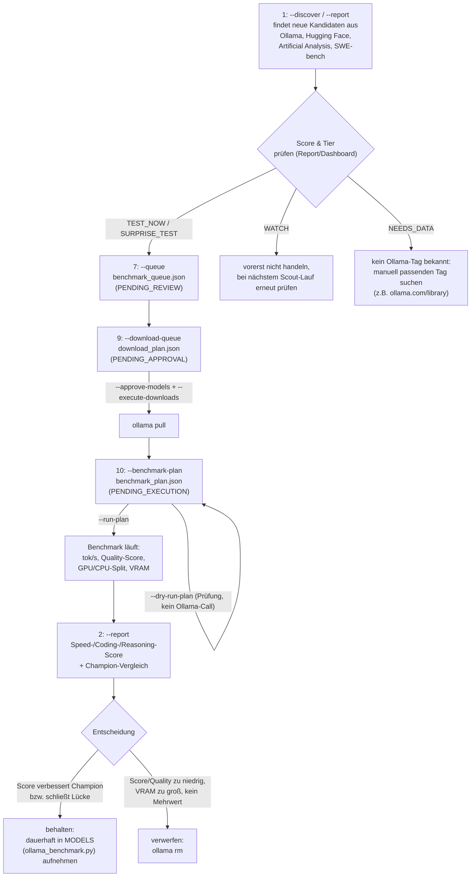
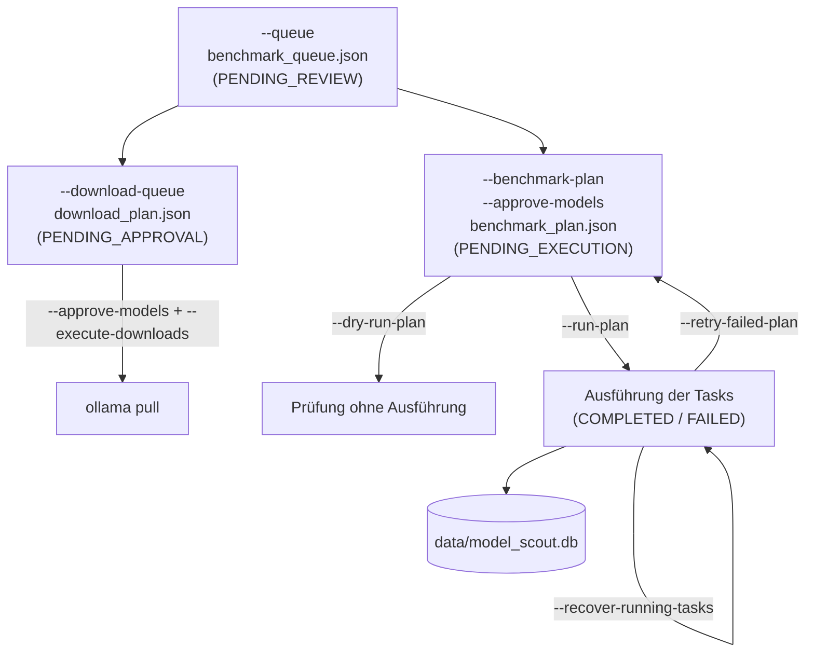
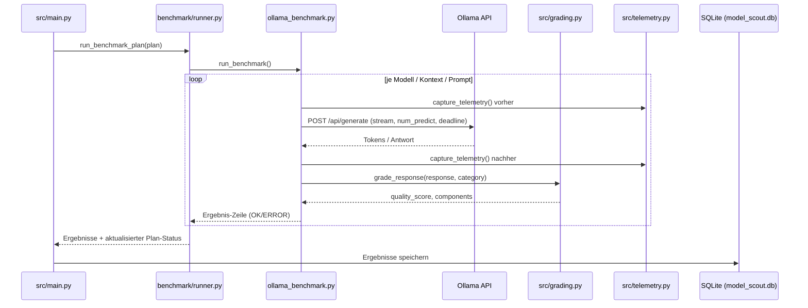

# LLM Model Scout

Lokaler Model-Discovery- und Benchmark-Scout für Ollama-Modelle, lokale Benchmark-Tests und erste Kandidaten-Auswertung.

## Überblick

Das Projekt kombiniert zwei Ebenen:

- Discovery: lokale Ollama-Modelle plus Hugging Face Kandidaten sammeln und normalisieren
- Erweiterung: zusätzlich Artificial Analysis und SWE-bench Kandidaten einbinden
- Benchmark: ausgewählte Modelle lokal mit definierter Kontextgröße und Prompts testen
- Reporting: zusammengefasste Kandidatenliste und erste Auswertung erzeugen
- Persistence: entdeckte Kandidaten in einer SQLite-Datenbank speichern und später wieder verwenden
- Dashboard: historische Summaries, Filters, Fehlertrends, Lauf-Delta und Hardware-Telemetrie visualisieren
- Champion/Challenger: echte Benchmark-Deltas statt reiner Score-Vergleiche nutzen

### Architekturüberblick



## Aktueller Status

Die aktuelle Implementierung ist vollständig für die verifizierte Test-Suite und umfasst:

- Discovery/Scoring/Ranking, inklusive `NEEDS_DATA`-Status
- Benchmark-Tasks, Recovery und Status-Updates
- Benchmark-Profile mit Speed-/Quality-Deltas
- Report- und Dashboard-Auswertung über die SQLite-Historie
- Multi-GPU und RAM/CPU-Telemetrie mit Peak-/Delta-Werten

## Voraussetzungen

- Python 3.11+
- Ollama lokal installiert und gestartet
- optional: Internetzugang für Hugging Face API-Abfragen

Prüfen:

```powershell
ollama list
ollama serve
```

## Installation

```powershell
python -m venv .venv
.\.venv\Scripts\Activate.ps1
pip install -r requirements.txt
```

## Nutzung

### Ablauf: Neuen Kandidaten entdecken, herunterladen, benchmarken und bewerten

Dieser Abschnitt beschreibt den kompletten Weg von einem neuen, unbekannten Modell bis zur Entscheidung "behalten oder verwerfen". Jeder Schritt ist bewusst manuell freizugeben; es gibt keinen Automatismus, der ungefragt Modelle herunterlädt oder benchmarkt.



**Schritt für Schritt:**

1. **Entdecken** ([Schritt 1](#1-kandidaten-entdecken)): `--discover` oder `--report` sammelt Kandidaten aus allen aktiven Quellen und speichert sie in `data/model_scout.db`.
2. **Einordnen**: Im Report (Abschnitt "Recommendations") bzw. im Dashboard steht pro Kandidat der Score, die Empfehlung (`TEST_NOW`, `SURPRISE_TEST`, `WATCH`, `IGNORE`) und der Bewertungsstatus (`ASSESSED`, `METADATA_ONLY`, `NEEDS_DATA`). Nur `TEST_NOW`/`SURPRISE_TEST`-Kandidaten lohnen in der Regel den nächsten Schritt.
3. **In die Queue aufnehmen** ([Schritt 7](#7-manuelle-benchmark-queue-erzeugen)): `--queue` erzeugt `benchmark_queue.json` mit den Top-Kandidaten (`PENDING_REVIEW`), ohne etwas herunterzuladen oder zu testen.
4. **Download freigeben** ([Schritt 9](#9-download-plan-prüfen-und-freigeben)): `--download-queue` erzeugt zunächst nur `PENDING_APPROVAL`-Einträge. Erst mit expliziten `--approve-models` und `--execute-downloads` wird `ollama pull` ausgeführt. Existiert für einen Hugging-Face-/Artificial-Analysis-/SWE-bench-Kandidaten kein passendes Ollama-Tag, muss der Tag manuell recherchiert werden (z.B. über `ollama.com/library`); ein `ollama pull <tag>` außerhalb der Queue ist dafür der pragmatische Weg.
5. **Benchmark-Plan erzeugen und ausführen** ([Schritt 10](#10-benchmark-plan-nach-freigabe-erzeugen)): `--benchmark-plan` erstellt je Modell/Kontext/Prompt-Kategorie einen `PENDING_EXECUTION`-Task; `--dry-run-plan` prüft ihn ohne Ollama-Aufruf, `--run-plan` führt ihn aus und speichert Ergebnisse (tok/s, Quality-Score, GPU/CPU-Split, VRAM) in SQLite und CSV.
6. **Bewerten**: Ein erneuter `--report`-Lauf ([Schritt 2](#2-report-erzeugen)) berücksichtigt die neuen Benchmark-Daten und zeigt im Abschnitt "Champion Comparison" den `speed_delta`/`quality_delta` gegenüber dem aktuellen Champion je Rolle (General/Coding/Reasoning, siehe `baseline` in `config.yaml`).
7. **Entscheiden**:
   - **Behalten**, wenn der Kandidat einen bestehenden Champion in Score, Geschwindigkeit oder Quality klar übertrifft oder eine bisher fehlende Nische abdeckt (z.B. sehr kleines VRAM-Budget, sehr hoher Kontext). Dauerhaft aufnehmen in die `MODELS`-Liste in [ollama_benchmark.py](ollama_benchmark.py), damit er bei künftigen `--run-benchmark`-Läufen automatisch mitgetestet wird.
   - **Verwerfen**, wenn Quality-Score und Relevance-Komponente durchgehend niedrig sind, das Modell bei den benötigten Kontextgrößen stark einbricht (siehe `CONTEXT COMPARISON` im Benchmark-Output) oder kein Mehrwert gegenüber dem Champion besteht. Mit `ollama rm <model>` wieder aus dem lokalen Cache entfernen.

**Benötigte Skripte/Dateien:** [src/main.py](src/main.py) (zentrale CLI für alle Schritte), [benchmark/runner.py](benchmark/runner.py) und [ollama_benchmark.py](ollama_benchmark.py) (führen den eigentlichen Benchmark aus), `data/model_scout.db` (Persistenz), `reports/benchmark_queue.json` → `reports/download_plan.json` → `reports/benchmark_plan.json` (die drei Zwischenstände der Freigabekette). Für die regelmäßige, automatisierte Discovery läuft [scripts/run_scout_report.ps1](scripts/run_scout_report.ps1) alle 14 Tage über den Windows Task Scheduler (siehe [Schritt 8](#8-zweiwöchigen-report-automatisieren)) — dieser automatisierte Lauf entdeckt und bewertet nur, lädt nichts herunter und benchmarkt nichts.

### 1) Kandidaten entdecken

```powershell
python src/main.py --discover --hf-limit 10
```

Für einen reproduzierbaren Lauf ohne externe Quellen:

```powershell
python src/main.py --report --offline --output reports/offline_model_scout.md
```

Wenn Ollama nicht erreichbar ist, verwendet der Offline-Lauf die konfigurierte Baseline als Report-Grundlage.

Das sammelt derzeit:

- lokale Ollama-Modelle
- einen kurzen Satz aus Hugging Face Kandidaten
- zusätzliche Kandidaten aus Artificial Analysis und SWE-bench
- dedupliziert und normalisiert die Modellnamen

Die Ergebnisse werden zusätzlich in einer lokalen SQLite-Datenbank unter `data/model_scout.db` persistiert.

### 2) Report erzeugen

```powershell
python src/main.py --report --hf-limit 10
```

Der Report wird als Markdown-Datei unter `reports/YYYY-MM-DD_model_scout.md` gespeichert. Mit `--output` kann ein anderer Zielpfad verwendet werden. Discovery- und Benchmark-Daten werden in `data/model_scout.db` archiviert; dieser Pfad kann mit `--db` geändert werden.

### 3) Lokalen Benchmark ausführen

```powershell
python src/main.py --run-benchmark --models qwen2.5-coder:14b-instruct --contexts 8192 16384
```

Oder ohne Einschränkung:

```powershell
python src/main.py --run-benchmark
```

### 4) Konfigurierte Baseline auflisten

```powershell
python src/main.py --list-models
```

### 5) Dashboard starten

```powershell
streamlit run dashboard.py
```

Das Dashboard liest die SQLite-Historie und zeigt Kandidaten, Empfehlungen, Benchmark-Task-Status und Fortschritt pro Modell, Report-Historie mit Lauf-Deltas, Qualitätswerte pro Kategorie, Latenz-/Prompt-Durchsatz, Benchmark-Fehler und Fehlertrends, `NEEDS_DATA`-Anzahl, durchschnittliche Benchmark-Geschwindigkeit, Kontextvergleiche und Hardware-Telemetrie. Modelle, Empfehlungen, Quellen und Hardware-Tiers können direkt gefiltert werden. Ein anderer Datenbankpfad kann über den Startparameter gesetzt werden:

```powershell
streamlit run dashboard.py -- --db data/alternative.db
```

### 6) Adaptive Gewichtung prüfen

Die Funktion `src/adaptive.py` kann historische Benchmark-Runs auswerten und eine vorgeschlagene Gewichtung berechnen. Die Änderung wird bewusst nicht automatisch in `config.yaml` geschrieben; dadurch bleibt jede Anpassung nachvollziehbar und reviewbar.

```powershell
python src/main.py --suggest-weights --output reports/weight_suggestion.json
```

### 7) Manuelle Benchmark-Queue erzeugen

```powershell
python src/main.py --queue --baseline-only --output reports/benchmark_queue.json
```

Die Queue enthält höchstens `--max-candidates` Modelle mit `TEST_NOW` oder `SURPRISE_TEST`. Sie startet keinen Download und keinen Benchmark automatisch; jedes Element bleibt zunächst auf `PENDING_REVIEW`.

Der Weg von der Queue bis zum ausgeführten Benchmark folgt einer bewusst kontrollierten, mehrstufigen Freigabekette:



### 8) Zweiwöchigen Report automatisieren

Das portable Skript [scripts/run_scout_report.ps1](scripts/run_scout_report.ps1) erzeugt einen Offline-Report mit repository-relativen Pfaden:

```powershell
powershell -ExecutionPolicy Bypass -File scripts/run_scout_report.ps1
```

Für den Windows Task Scheduler wird dieses Skript als Aktion mit dem Trigger `Alle 14 Tage` hinterlegt. Es startet keine Downloads und keinen lokalen Modellbenchmark.

### 9) Download-Plan prüfen und freigeben

```powershell
python src/main.py --download-queue reports/benchmark_queue.json --output reports/download_plan.json
```

Das erzeugt zunächst nur `PENDING_APPROVAL`-Einträge. Nach manueller Prüfung können ausgewählte Modelle explizit freigegeben und ausgeführt werden:

```powershell
python src/main.py --download-queue reports/benchmark_queue.json --approve-models deepseek-coder:latest --execute-downloads
```

Ohne `--execute-downloads` wird kein `ollama pull` gestartet.

### 10) Benchmark-Plan nach Freigabe erzeugen

```powershell
python src/main.py --benchmark-plan reports/benchmark_queue.json --approve-models deepseek-coder:latest --contexts 8192 16384 --output reports/benchmark_plan.json
```

Der Plan erzeugt je freigegebenem Modell, Kontext und persönlicher Prompt-Kategorie einen `PENDING_EXECUTION`-Task. Die Ausführung bleibt ein separater, kontrollierbarer Schritt.

Nach Prüfung kann der Plan explizit ausgeführt werden:

```powershell
python src/main.py --run-plan reports/benchmark_plan.json --max-tasks 1 --db data/model_scout.db
```

Dabei werden ausschließlich Tasks mit `PENDING_EXECUTION` ausgeführt und die Ergebnisse anschließend in SQLite gespeichert.
Die Plan-Datei wird dabei ebenfalls auf `COMPLETED` oder `FAILED` aktualisiert.
Mit `--max-tasks` kann die Ausführung schrittweise begrenzt werden; nicht ausgewählte Pending-Tasks bleiben offen.
Mit `--request-timeout 300` kann das Zeitlimit pro Ollama-Anfrage angepasst werden; der Standardwert beträgt 600 Sekunden.
CSV-Ergebnisse werden standardmäßig unter `data/benchmarks/` gespeichert und können mit `--results-dir` umgeleitet werden.

Vor der Ausführung kann der Plan sicher geprüft werden:

```powershell
python src/main.py --dry-run-plan reports/benchmark_plan.json
```

Der Dry Run startet kein Ollama und verändert keine Benchmark-Daten.

Eine kompakte Übersicht der SQLite-Daten erhältst du mit:

```powershell
python src/main.py --db-summary --db data/model_scout.db
```

Die Übersicht enthält auch die Anzahl fehlgeschlagener Benchmark-Runs.

Den Status der Benchmark-Tasks kannst du separat prüfen:

```powershell
python src/main.py --task-status --db data/model_scout.db
```

Die Discovery-Quellen können separat geprüft werden:

```powershell
python src/main.py --source-status --offline --hf-limit 0
```

Fehlgeschlagene Tasks können gezielt wieder freigegeben werden:

```powershell
python src/main.py --retry-failed-plan reports/benchmark_plan.json --db data/model_scout.db
```

Nach einem abgebrochenen Prozess können verwaiste `RUNNING`-Tasks zurückgesetzt werden:

```powershell
python src/main.py --recover-running-tasks --db data/model_scout.db
```

## Projektstruktur

```text
.
├── README.md
├── IMPLEMENTATION_GUIDE.md
├── config.yaml
├── requirements.txt
├── ollama_benchmark.py
├── dashboard.py
├── reports/
│   ├── benchmark_queue.json
│   ├── benchmark_plan.json
│   ├── download_plan.json
│   └── offline_model_scout.md
├── scripts/
│   └── run_scout_report.ps1
├── benchmark/
│   ├── runner.py
│   └── prompts/
│       ├── __init__.py
│       └── personal.py
├── src/
│   ├── main.py
│   ├── pipeline.py
│   ├── report.py
│   ├── database.py
│   ├── discovery.py
│   ├── scoring.py
│   ├── adaptive.py
│   ├── benchmark_plan.py
│   ├── benchmark_queue.py
│   ├── download_queue.py
│   ├── grading.py
│   ├── telemetry.py
│   └── sources/
│       ├── __init__.py
│       ├── artificial_analysis.py
│       ├── swebench.py
│       ├── ollama.py
│       └── huggingface.py
├── tests/
│   ├── test_discovery.py
│   ├── test_ollama_source.py
│   ├── test_huggingface_source.py
│   ├── test_report.py
│   ├── test_dashboard.py
│   ├── test_workflow.py
│   ├── test_champion.py
│   ├── test_adaptive.py
│   ├── test_prompts.py
│   ├── test_dashboard_filters.py
│   ├── test_telemetry.py
│   ├── test_source_http.py
│   ├── test_download_queue.py
│   ├── test_ollama_details.py
│   ├── test_ollama_metadata.py
│   ├── test_stream_metrics.py
│   ├── test_report_reasons.py
│   ├── test_configured_scoring.py
│   ├── test_scheduler_script.py
│   ├── test_adaptive_cli.py
│   ├── test_benchmark_plan.py
│   ├── test_benchmark_task_status.py
│   ├── test_benchmark_scoring.py
│   ├── test_grading.py
│   ├── test_huggingface_filter.py
│   └── test_dashboard_quality.py
├── data/
├── reports/
└── .env.example
```

## Ablauf eines einzelnen Benchmark-Runs



## Wichtige Hinweise

- Der lokale Benchmark nutzt Ollama auf `http://localhost:11434/api/generate`.
- Der Benchmark verwendet den versionierten Promptkatalog `v1` und speichert Prompt-Version sowie Prompt-tok/s in SQLite und CSV.
- Jeder Benchmark-Run erhält zusätzlich einen transparent gekennzeichneten Quality-Score; dieser ist ein technischer Hinweis und kein menschlicher Qualitätsentscheid.
- Der aktuelle Grader `heuristic_v2` speichert zusätzlich Teilwerte für Vollständigkeit, Struktur, Relevanz und eine Konfidenz.
- Bei der nächsten Report-Erzeugung werden gespeicherte Benchmark-Runs wieder in Speed-, Coding- und Reasoning-Score der betroffenen Modelle übernommen.
- Reports enthalten zusätzlich eine Benchmark-Evidence mit gemessener Geschwindigkeit, Quality-Score, erfolgreicher Run-Anzahl und Kontextvergleich.
- Fehlerhafte Benchmark-Runs speichern ihren Fehlertext in SQLite, damit Timeouts und Ollama-Probleme im Dashboard nachvollziehbar bleiben.
- TTFT wird im Benchmark über Ollama-Streaming bis zum ersten Antworttoken gemessen und in CSV sowie SQLite gespeichert.
- Wenn verfügbar, werden zusätzlich GPU-Auslastung, GPU-Speicher, RAM-Nutzung und CPU-Auslastung über `nvidia-smi` und `psutil` erfasst. Bei Multi-GPU-Systemen werden Anzahl, mittlere/peak GPU-Auslastung, aggregierter Speicher und Speicherauslastung gespeichert.
- Neue Benchmark-Runs speichern außerdem einen UTC-Zeitstempel, Messdauer sowie Vorher/Nachher-Deltas und Peak-Werte für GPU, RAM und CPU; ältere Runs bleiben mit den bisherigen Feldern kompatibel.
- Ollama-Kandidaten werden über `/api/show` um Architektur, Quantisierung, Parametergröße und Kontextlänge angereichert.
- Hugging Face filtert bekannte Nicht-Text-Generationsmodelle wie Embedding- und Encoder-Modelle aus der LLM-Kandidatenliste.
- Externe Quellen verwenden `.env`-Tokens, JSON-Validierung, Timeouts und Retries für temporäre HTTP-Fehler.
- Endpunkte können über Umgebungsvariablen überschrieben werden; für Artificial Analysis ist `ARTIFICIAL_ANALYSIS_API_KEY` erforderlich.
- Die Discovery-Ausgabe ist bewusst einfach und soll als Grundlage für spätere Scoring- und Ranking-Logik dienen.
- Jeder Report enthält eine Source-Coverage mit Kandidatenanzahl pro Quelle; `0` bedeutet, dass die Quelle in diesem Lauf keine verwertbaren Kandidaten geliefert hat.
- Jeder Kandidat erhält im Report einen Bewertungsstatus: `ASSESSED`, `METADATA_ONLY` oder `NEEDS_DATA`.
- Jeder Report enthält zusätzlich den Quellenstatus `OK`, `EMPTY`, `DISABLED` oder `ERROR`, damit leere externe Quellen diagnostizierbar bleiben.
- Die Kandidaten werden anhand der konfigurierten Gewichtung bewertet und in `TEST_NOW`, `SURPRISE_TEST`, `WATCH` und `IGNORE` eingeteilt.
- Kandidaten ohne eigene Qualitätsmessung werden als `NEEDS_DATA` mit Score `not assessed` geführt; sie werden nicht fälschlich als `IGNORE` mit neutralem Score bewertet.
- Die Quellenadapter sind fehlertolerant: eine nicht erreichbare externe Quelle verhindert nicht die lokale Ollama-Auswertung.
- SWE-bench liefert Kandidaten durch Parsen des in `swebench.com` eingebetteten `leaderboard-data`-JSON-Blocks (keine offizielle API). Artificial Analysis nutzt ohne konfigurierten `ARTIFICIAL_ANALYSIS_API_KEY` einen Best-Effort-Fallback über die auf der Startseite verlinkten Modelle (nur ein Ausschnitt der vollen Rangliste).
- Welche Quellen aktiv sind, wird im Abschnitt `sources` von `config.yaml` gesteuert.
- [IMPLEMENTATION_GUIDE.md](IMPLEMENTATION_GUIDE.md) beschreibt Architektur, Datenmodell und verbleibende Betriebsschritte.

## Nächste Erweiterungen

- zusätzliche Qualitätsgrader für Antwortqualität und Coding-Ergebnisse

## Weiterführende Doku

- [IMPLEMENTATION_GUIDE.md](IMPLEMENTATION_GUIDE.md)
- [README_PROJECT.md](README_PROJECT.md)
